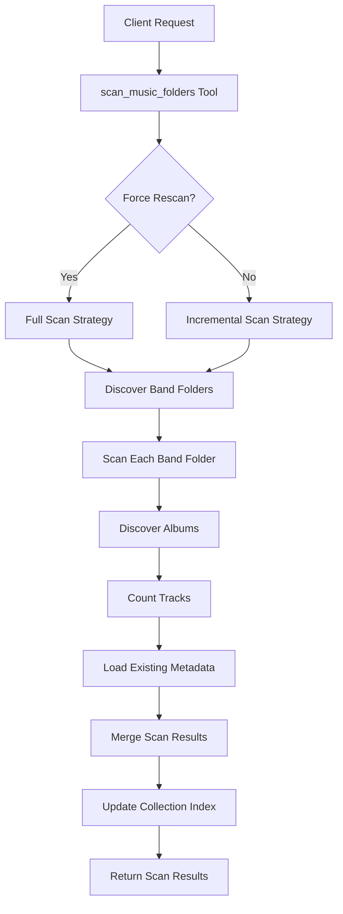
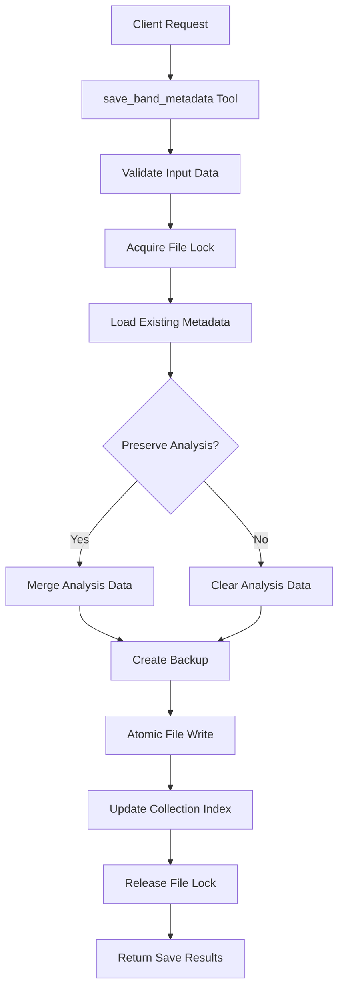
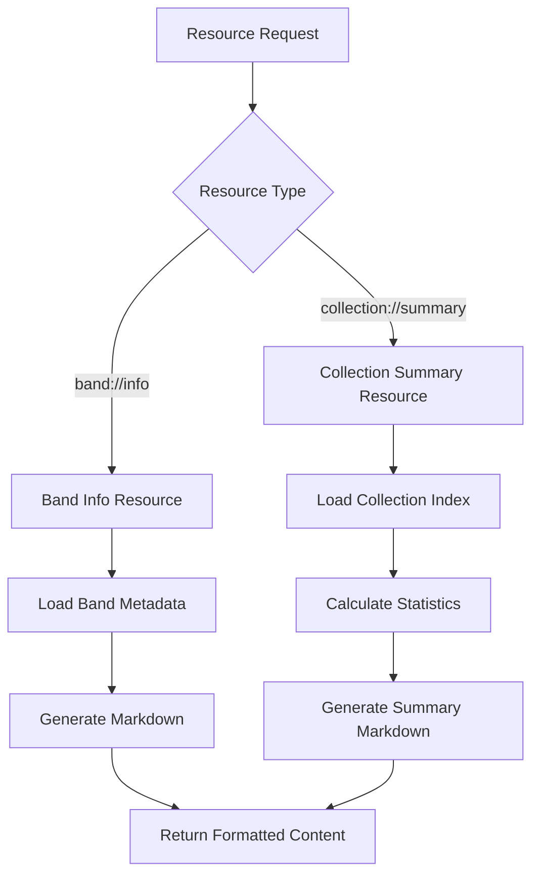

# Music Collection MCP Server - Architecture Guide

## Overview

The Music Collection MCP Server is built using a modular, file-system-based architecture that provides intelligent access to local music collections through the Model Context Protocol (MCP). This document details the system architecture, design patterns, and integration strategies.

## High-Level Architecture

```
┌─────────────────────────────────────────────────────────────────┐
│                        MCP Client Layer                        │
│  ┌─────────────────┐  ┌─────────────────┐  ┌─────────────────┐  │
│  │   Claude App    │  │   Cline Plugin  │  │  Custom Client  │  │
│  └─────────────────┘  └─────────────────┘  └─────────────────┘  │
└─────────────────────────────────────────────────────────────────┘
                                  │
                    ┌─────────────────────────────┐
                    │      JSON-RPC over stdio   │
                    └─────────────────────────────┘
                                  │
┌─────────────────────────────────────────────────────────────────┐
│                    Music Collection MCP Server                  │
│                                                                 │
│  ┌─────────────────┐  ┌─────────────────┐  ┌─────────────────┐  │
│  │      Tools      │  │    Resources    │  │     Prompts     │  │
│  │   (5 tools)     │  │  (2 resources)  │  │   (4 prompts)   │  │
│  └─────────────────┘  └─────────────────┘  └─────────────────┘  │
│                                                                 │
│  ┌─────────────────────────────────────────────────────────────┐  │
│  │                    Core Services                            │  │
│  │  ┌─────────────┐  ┌─────────────┐  ┌─────────────────────┐  │  │
│  │  │   Scanner   │  │   Storage   │  │       Cache         │  │  │
│  │  │   Service   │  │   Service   │  │      Service        │  │  │
│  │  └─────────────┘  └─────────────┘  └─────────────────────┘  │  │
│  └─────────────────────────────────────────────────────────────┘  │
│                                                                 │
│  ┌─────────────────────────────────────────────────────────────┐  │
│  │                   Data Models                               │  │
│  │  ┌─────────────┐  ┌─────────────┐  ┌─────────────────────┐  │  │
│  │  │    Band     │  │ Collection  │  │      Migration      │  │  │
│  │  │   Models    │  │   Models    │  │      Models         │  │  │
│  │  └─────────────┘  └─────────────┘  └─────────────────────┘  │  │
│  └─────────────────────────────────────────────────────────────┘  │
└─────────────────────────────────────────────────────────────────┘
                                  │
┌─────────────────────────────────────────────────────────────────┐
│                      File System Layer                         │
│                                                                 │
│  ┌─────────────────────────────────────────────────────────────┐  │
│  │                  Music Collection                           │  │
│  │                                                             │  │
│  │  Band Folder 1/                Band Folder 2/              │  │
│  │  ├── Album 1/                  ├── Album 1/                │  │
│  │  ├── Album 2/                  ├── Album 2/                │  │
│  │  └── .band_metadata.json       └── .band_metadata.json     │  │
│  │                                                             │  │
│  │  .collection_index.json                                    │  │
│  └─────────────────────────────────────────────────────────────┘  │
└─────────────────────────────────────────────────────────────────┘
```

## Core Components

### 1. MCP Server Core (`src/music_mcp_server.py`)

The main server implementation using FastMCP framework:

#### Responsibilities
- **Server Initialization**: FastMCP server setup and configuration
- **Component Registration**: Tools, resources, and prompts registration
- **Request Routing**: JSON-RPC request handling and routing
- **Error Handling**: Centralized error handling and logging
- **Configuration Management**: Environment variable and settings handling

#### Key Features
- **FastMCP Integration**: Modern MCP framework with automatic serialization
- **Type Safety**: Full Pydantic v2 integration for type validation
- **Concurrent Safety**: File locking and atomic operations
- **Resource Management**: Efficient memory and file handle management

### 2. Data Models (`src/models/`)

Pydantic v2-based data models providing type safety and validation:

#### Band Models (`band.py`)
```python
# Core album representation
class Album(BaseModel):
    album_name: str
    year: Optional[str] = None
    genres: List[str] = []
    tracks_count: Optional[int] = None
    duration: Optional[str] = None
    missing: bool = False

# Album analysis data
class AlbumAnalysis(BaseModel):
    album_name: str
    review: Optional[str] = None
    rate: Optional[int] = Field(None, ge=1, le=10)

# Complete band metadata
class BandMetadata(BaseModel):
    band_name: str
    formed: Optional[str] = None
    genres: List[str] = []
    origin: Optional[str] = None
    members: List[str] = []
    albums_count: int = 0
    description: Optional[str] = None
    albums: List[Album] = []
    last_updated: str = Field(default_factory=lambda: datetime.utcnow().isoformat())
    analyze: Optional[BandAnalysis] = None
```

#### Collection Models (`collection.py`)
```python
# Collection index entry for fast access
class BandIndexEntry(BaseModel):
    band_name: str
    folder_path: str
    albums_count: int = 0
    local_albums: int = 0
    missing_albums: int = 0
    has_metadata: bool = False
    has_analysis: bool = False
    last_updated: str

# Collection-wide statistics
class CollectionStats(BaseModel):
    total_bands: int = 0
    total_albums: int = 0
    total_missing_albums: int = 0
    bands_with_metadata: int = 0
    bands_with_analysis: int = 0
    completion_percentage: float = 0.0
```

### 3. Scanner Service (`src/tools/scanner.py`)

File system scanner for music collection discovery:

#### Architecture Pattern: Observer + Strategy
```python
class MusicScanner:
    def __init__(self, config: Config):
        self.config = config
        self.file_filters = self._setup_filters()
        self.observers = []  # Progress observers
    
    def scan_music_folders(self, force_rescan: bool = False) -> ScanResult:
        # Strategy pattern for different scan modes
        strategy = FullScanStrategy() if force_rescan else IncrementalScanStrategy()
        return strategy.execute(self)
```

#### Key Features
- **Incremental Scanning**: Only scan changed directories
- **File Type Detection**: Support for 9+ music file formats
- **Progress Reporting**: Real-time scan progress updates
- **Error Recovery**: Graceful handling of permission errors
- **Concurrent Safety**: File locking during scan operations

### 4. Storage Service (`src/tools/storage.py`)

Atomic file operations and data persistence:

#### Architecture Pattern: Repository + Unit of Work
```python
class StorageService:
    def __init__(self, config: Config):
        self.config = config
        self.file_locks = {}  # Concurrent access control
        self.backup_manager = BackupManager()
    
    async def save_band_metadata(self, band_name: str, metadata: BandMetadata) -> SaveResult:
        async with self._get_lock(band_name):
            # Unit of work pattern
            with self.backup_manager.create_backup(band_name):
                return await self._atomic_save(band_name, metadata)
```

#### Key Features
- **Atomic Operations**: All-or-nothing file writes
- **Backup Management**: Automatic backup creation before modifications
- **File Locking**: Thread-safe concurrent access
- **Data Validation**: Pydantic integration for type safety
- **Error Recovery**: Rollback capabilities on failure

### 5. Cache Service (`src/tools/cache.py`)

Intelligent caching for performance optimization:

#### Architecture Pattern: Cache-Aside + TTL
```python
class CacheService:
    def __init__(self, config: Config):
        self.config = config
        self.memory_cache = {}  # In-memory cache
        self.file_cache = FileCacheManager()  # Persistent cache
        self.ttl_manager = TTLManager()  # Time-based invalidation
    
    def get_cached_data(self, key: str) -> Optional[Any]:
        # Multi-level cache hierarchy
        if data := self.memory_cache.get(key):
            return data
        if data := self.file_cache.get(key):
            self.memory_cache[key] = data
            return data
        return None
```

#### Key Features
- **Multi-Level Caching**: Memory + file-based caching
- **TTL Management**: Configurable time-to-live
- **Cache Invalidation**: Smart invalidation based on file timestamps
- **Memory Management**: LRU eviction for memory cache
- **Performance Metrics**: Cache hit/miss tracking

## Data Flow Architecture

### 1. Collection Scanning Flow



### 2. Metadata Save Flow



### 3. Resource Access Flow



## Integration Patterns

### 1. MCP Client Integration

#### FastMCP Transport Layer
```python
# Server initialization with FastMCP
app = FastMCP("music-collection-mcp")

# Tool registration with automatic schema generation
@app.tool()
async def scan_music_folders(force_rescan: bool = False) -> ScanResult:
    """Scan music collection for bands and albums."""
    scanner = MusicScanner(config)
    return await scanner.scan_music_folders(force_rescan)

# Resource registration with dynamic URI handling
@app.resource("band://info/{band_name}")
async def get_band_info(band_name: str) -> str:
    """Get band information in markdown format."""
    return await band_info_service.get_markdown(band_name)
```

#### JSON-RPC Communication
- **Transport**: stdio-based JSON-RPC
- **Serialization**: Automatic Pydantic serialization
- **Error Handling**: Structured error responses
- **Streaming**: Support for large data responses

### 2. External Service Integration

#### Brave Search MCP Integration
```python
# Prompt generation for external data fetching
@app.prompt("fetch_band_info")
def fetch_band_info_prompt(band_name: str = "", information_scope: str = "full") -> PromptMessage:
    """Generate prompt for fetching band information via Brave Search."""
    return PromptMessage(
        role="user",
        content=generate_fetch_prompt(band_name, information_scope)
    )
```

#### Integration Flow
1. **Client Request**: Request for band information
2. **Prompt Generation**: Create Brave Search prompt
3. **External Query**: Client uses prompt with Brave Search MCP
4. **Data Processing**: Structure response data
5. **Local Storage**: Save fetched data using storage service

### 3. File System Integration

#### Directory Structure Convention
```
music_collection/
├── .collection_index.json          # Collection-wide index
├── Band Name 1/
│   ├── .band_metadata.json         # Band-specific metadata
│   ├── Album 1/
│   │   ├── track1.mp3
│   │   └── track2.mp3
│   └── Album 2/
│       ├── track1.flac
│       └── track2.flac
└── Band Name 2/
    ├── .band_metadata.json
    └── Album 1/
        ├── track1.wav
        └── track2.wav
```

#### File Access Patterns
- **Read-Heavy Optimization**: Collection index for fast access
- **Write Optimization**: Atomic operations with backups
- **Concurrent Access**: File locking mechanisms
- **Error Recovery**: Backup and rollback capabilities

## Configuration Architecture

### Environment-Based Configuration

```python
class Config(BaseSettings):
    # Core paths
    music_root_path: str = Field(..., env="MUSIC_ROOT_PATH")
    
    # Cache settings
    cache_duration_days: int = Field(30, env="CACHE_DURATION_DAYS")
    
    # Performance settings
    max_concurrent_scans: int = Field(4, env="MAX_CONCURRENT_SCANS")
    memory_cache_size_mb: int = Field(100, env="MEMORY_CACHE_SIZE_MB")
    
    # File handling
    backup_retention_days: int = Field(7, env="BACKUP_RETENTION_DAYS")
    atomic_write_timeout: int = Field(30, env="ATOMIC_WRITE_TIMEOUT")
    
    class Config:
        env_file = ".env"
        case_sensitive = False
```

### Configuration Validation
- **Path Validation**: Ensure music directory exists and is accessible
- **Permission Checks**: Verify read/write permissions
- **Dependency Validation**: Check required external tools
- **Performance Limits**: Validate memory and concurrency settings

## Error Handling Architecture

### Layered Error Handling

```python
# Custom exception hierarchy
class MusicMCPError(Exception):
    """Base exception for Music MCP Server."""
    pass

class ScanError(MusicMCPError):
    """Errors during collection scanning."""
    pass

class StorageError(MusicMCPError):
    """Errors during data storage operations."""
    pass

class ValidationError(MusicMCPError):
    """Data validation errors."""
    pass
```

### Error Recovery Strategies

#### Graceful Degradation
- **Partial Results**: Return available data when some operations fail
- **Fallback Operations**: Use cached data when real-time operations fail
- **Service Isolation**: Prevent single component failures from affecting others

#### Recovery Mechanisms
- **Automatic Retry**: Configurable retry logic for transient failures
- **Backup Restoration**: Automatic rollback on data corruption
- **Service Restart**: Graceful service restart on critical errors

## Performance Architecture

### Scalability Patterns

#### Horizontal Scaling (Collection Size)
- **Indexed Access**: Collection index for O(1) band lookups
- **Lazy Loading**: Load band metadata on-demand
- **Streaming Operations**: Process large collections in chunks
- **Memory Management**: Configurable memory limits

#### Vertical Scaling (System Resources)
- **Concurrent Operations**: Thread-safe parallel processing
- **Memory Optimization**: Efficient data structures and caching
- **I/O Optimization**: Asynchronous file operations
- **CPU Optimization**: Efficient algorithms for large datasets

### Performance Monitoring

#### Metrics Collection
```python
class PerformanceMetrics:
    def __init__(self):
        self.scan_times = []
        self.cache_hit_rates = {}
        self.memory_usage = []
        self.error_rates = {}
    
    def record_scan_performance(self, duration: float, bands_count: int):
        self.scan_times.append({
            'duration': duration,
            'bands_count': bands_count,
            'timestamp': datetime.utcnow()
        })
```

#### Performance Thresholds
- **Scan Performance**: < 60 seconds for 1000 bands
- **Memory Usage**: < 500 MB for large collections
- **Response Time**: < 5 seconds for band list operations
- **Cache Efficiency**: > 80% cache hit rate for repeated operations

## Security Architecture

### File System Security

#### Access Control
- **Path Validation**: Prevent directory traversal attacks
- **Permission Checking**: Verify file system permissions
- **Sandboxing**: Restrict access to music directory only
- **Input Sanitization**: Validate all file paths and names

#### Data Protection
- **Backup Encryption**: Optional encryption for backup files
- **Secure Deletion**: Secure overwrite for sensitive data
- **Access Logging**: Track file access patterns
- **Integrity Checking**: Detect file corruption

### Network Security

#### MCP Communication
- **Input Validation**: Validate all MCP requests
- **Rate Limiting**: Prevent abuse of server resources
- **Error Information**: Sanitize error messages
- **Session Management**: Secure client session handling

## Testing Architecture

### Test Categories

#### Unit Tests
- **Model Tests**: Pydantic model validation and serialization
- **Service Tests**: Individual service component testing
- **Utility Tests**: Helper function and utility testing
- **Integration Tests**: Component interaction testing

#### Performance Tests
- **Load Testing**: Large collection performance testing
- **Stress Testing**: Concurrent operation testing
- **Memory Testing**: Memory usage and leak detection
- **Benchmark Testing**: Performance threshold validation

#### Integration Tests
- **MCP Integration**: Full MCP client-server testing
- **File System**: File operation and permission testing
- **External Services**: Brave Search integration testing
- **Error Scenarios**: Failure and recovery testing

### Test Infrastructure

#### Docker-Based Testing
```dockerfile
# Test environment isolation
FROM python:3.11-slim
COPY requirements.txt .
RUN pip install -r requirements.txt
COPY . /app
WORKDIR /app
CMD ["python", "-m", "pytest", ".", "-v"]
```

#### Continuous Testing
- **Automated Test Execution**: CI/CD integration
- **Performance Regression**: Automated performance testing
- **Coverage Reporting**: Comprehensive test coverage metrics
- **Quality Gates**: Quality thresholds for releases

## Deployment Architecture

### Deployment Options

#### Local Development
```bash
# Direct Python execution
python main.py

# Development with hot reload
python -m uvicorn main:app --reload
```

#### Docker Deployment
```dockerfile
FROM python:3.11-slim
WORKDIR /app
COPY requirements.txt .
RUN pip install --no-cache-dir -r requirements.txt
COPY . .
EXPOSE 8000
CMD ["python", "main.py"]
```

#### MCP Client Integration
```json
{
  "mcpServers": {
    "music-collection": {
      "command": "python",
      "args": ["/path/to/main.py"],
      "env": {
        "MUSIC_ROOT_PATH": "/path/to/music",
        "CACHE_DURATION_DAYS": "30"
      }
    }
  }
}
```

### Production Considerations

#### Monitoring
- **Health Checks**: Server health and availability monitoring
- **Performance Metrics**: Real-time performance tracking
- **Error Monitoring**: Error rate and pattern analysis
- **Resource Usage**: Memory and CPU usage monitoring

#### Maintenance
- **Backup Strategies**: Regular metadata backup procedures
- **Update Procedures**: Safe server update processes
- **Recovery Plans**: Disaster recovery and data restoration
- **Performance Tuning**: Ongoing performance optimization

## Future Architecture Considerations

### Extensibility

#### Plugin Architecture
- **Plugin Interface**: Standardized plugin API
- **Dynamic Loading**: Runtime plugin loading and configuration
- **Custom Tools**: User-defined MCP tools and resources
- **External Integrations**: Third-party service integrations

#### Schema Evolution
- **Version Management**: Schema versioning and migration
- **Backward Compatibility**: Support for older schema versions
- **Custom Fields**: User-defined metadata fields
- **Data Transformation**: Automated data transformation pipelines

### Advanced Features

#### AI Integration
- **Machine Learning**: Automated band and album analysis
- **Recommendation Engine**: Intelligent music recommendations
- **Natural Language**: Advanced prompt processing
- **Predictive Analytics**: Collection trend analysis

#### Cloud Integration
- **Cloud Storage**: Optional cloud metadata storage
- **Synchronization**: Multi-device collection synchronization
- **Backup Services**: Cloud-based backup solutions
- **Analytics Services**: Cloud-based analytics and insights 